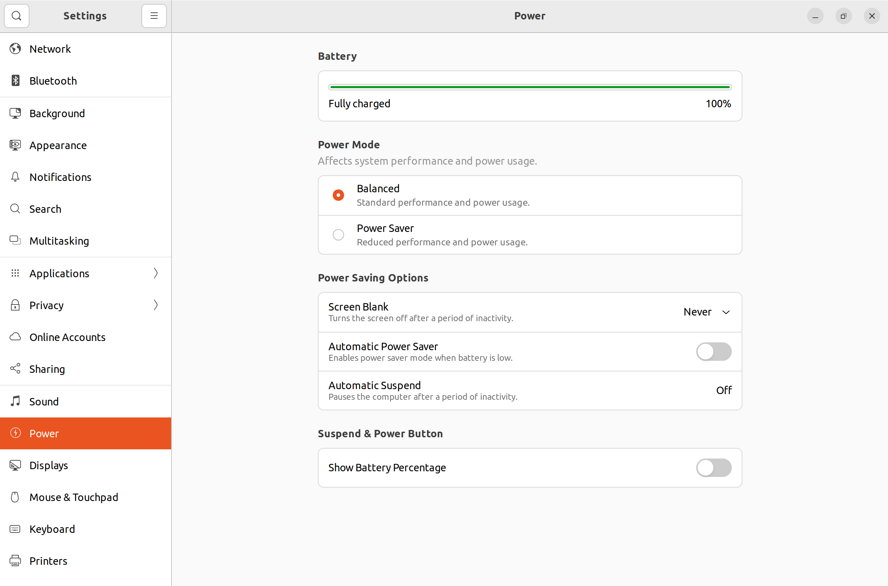

# moodle_opencast_ubuntu_vm
This repository contains information about setting up an Ubuntu-VM for Moodle development without or with Opencast
as well as helper scripts, to make this process straightforward. In the following guide, VirtualBox 6.1 is used
as virtualization software.

**Note - Under construction**<br>
This guide contains only the setup of the Ubuntu-VM so far. Other parts will follow as soon as possible.

---

## License
Copyright (C) 2022 Matthias Kollenbroich.

Permission is granted to copy, distribute and/or modify this document
under the terms of the GNU Free Documentation License, Version 1.3
or any later version published by the Free Software Foundation;
with no Invariant Sections, no Front-Cover Texts, and no Back-Cover Texts.

You should have received a copy of the GNU Free Documentation License
along with this document. If not, see https://www.gnu.org/licenses/.

---

## Create the Ubuntu-VM with VirtualBox
To create an Ubuntu-VM with VirtualBox, do the following steps:
1. Download (from *https://www.virtualbox.org*) and install VirtualBox.
2. Download an Ubuntu image (*iso* file from *https://ubuntu.com/download/desktop*).
3. Start VirtualBox and create a new virtual machine:
   1. Name and operating system:
      1. Choose a name. 
      2. Choose a machine folder: This is where your virtual machines will be stored, so you can
         resume working on them, whenever you like.
      3. Type: Linux
      4. Version: Ubuntu (64-bit)
   2. Memory size:
      1. Select the amount of RAM from your main PC, that the virtual machine will access. Be sure
         to remain inside the green bar, to ensure, you can continue to work outside the VM,
         whilst it is running.
   3. Hard disk:
      1. Select *Create a virtual hard disk now*.
   4. Hard disk file type:
      1. Select *VDI (VirtualBox Disk Image)*.
   5. Storage on physical hard disk:
      1. Select *Dynamically allocated*.
   6. File location and size:
      1. Choose a path for the virtual hard disk file (default is okay). 
      2. Choose a size for the virtual hard disk.
4. Install the Ubuntu image:
   1. Launch the newly created virtual machine.
   2. Select the downloaded Ubuntu image (*iso* file).
   3. Click *Start*.
   4. Select *Try or Install Ubuntu* from the boot menu.
   5. Install Ubuntu Desktop normally:
      1. Choose a language.
      2. Select *Install Ubuntu*.
      3. Choose a keyboard layout.
      4. Choose *Normal installation* and check *Download updates while installing Ubuntu*.
      5. Choose *Erase disk and install Ubuntu* and click *Install Now*.
      6. Click *Continue*.
      7. Select a location.
      8. Create your account (e.g., username is *moodle-dev* and password is *admin* as well as
         select *Log in automatically*).
      9. Click *Restart Now* after installation.
      10. Press *Enter*, when you see the text *Please remove installation medium, then press
          ENTER*.
      11. Select your desired settings in the windows, that are shown after the first login.
      12. If there are a software updates, install them and restart the VM, if required.
   6. Change the screen resolution to a fitting one:
      1. In the Ubuntu-VM, go to *Settings -> Displays* and change the resolution to a fitting one (the
         VirtualBox window for this Ubuntu-VM will have this size).

In addition, it is very helpful for a better performance of the complete VM, to increase the amount
of processor cores under *Settings -> System -> Processor* in VirtualBox.

Furthermore, it is useful, to apply the following power settings (under *Settings -> Power*) in the VM,
since the VM is used as a server, for a better performance:<br><br>


If the VM is displayed in, e.g., *4k*, one should change the *Scale Factor* in the settings of the VM
in VirtualBox under *Display* to, e.g., *200%*, for a better performance, too.

---

## Map the document root directory of Apache to a host directory
For Moodle a web server is required. For this guide, this web server will be Apache.
A Moodle installation must be installed to the document root directory of Apache (*/var/www/html*)
and should not be writeable by the web server user.
Furthermore, for development it is very helpful, to map this directory to a directory on the host system of the VM.
To do so, do the following steps:
1. Create the directory */var/www/html* on the VM, if it does not exist already, with the command:<br>
   ```
   sudo mkdir -p /var/www/html
   ```
2. Make the Moodle installations not writeable by the web server user by executing the following commands on the VM:<br>
   ```
   sudo chown -R root /var/www/html
   sudo chmod -R 0755 /var/www/html
   ```
3. To create the mapping for the Moodle installations directory, a shared folder must be added to the VM. 
   To do so, do the following steps:
   1. Install some required packages for the installation of the *Guest Additions* on the VM with the command:
      ```
      sudo apt-get install build-essential
      ```
   2. Select *Devices -> Insert Guest Additions CD image...* from the menu of the window of the VM on the host system.
   3. After the disk has been inserted, on the VM navigate to the directory */media/&#60;USER&#62;/VBox_GAs_&#60;VERSION&#62;*,
      whereat *&#60;USER&#62;* is the name of your account on the VM, and execute the following command:
      ```
      sudo sh ./VBoxLinuxAdditions.run
      ```
   4. Restart the VM after checking, that there were no errors (note, that the resolution of the VM
      is automatically adjusted to the size of the window of the VM, if the *Guest Additions* have been installed).
   5. To access shared/mapped folders, a user must be added to the user group *vboxsf*. To do so,
      run the following command on the VM and restart the VM afterwards, whereat *&#60;USER&#62;* is the name
      of your account on the VM:
      ```
      sudo adduser <USER> vboxsf
      ```
   6. Shutdown the VM.
   7. Navigate to *Settings -> Shared Folders* for the VM in VirtualBox.
   8. Add a new shared folder by right-clicking on the list of shared folders.
   9. Select the folder on the host system, that should be shared/mapped, set it to *read-only* as well as to *permanent*,
      enable *automatic mounting*, leave the folder name as default (*.*) and enter the path */var/www/html* as mount point 
      (the selected folder from the host system will appear now as the folder */var/www/html* on the VM automatically;
      note, that the shared folder on the host system will contain the Moodle versions for the VM in this guide).
   10. Accept the settings for the VM and start the VM again, to check, whether the mapping works.

Note, that a restart of the VM is required/recommended, when you change the shared folder settings,
because of undefined behavior (some files are missing, if you access the shared folder to fast after changing the settings,
or mounting of the folder fails etc.).

---

## Access the Moodle installations from a browser on the host
By default, a Moodle installation on the VM cannot be accessed from a browser on the host, because the VM
is connected to a private network internal to VirtualBox and invisible to the host. Therefore, network services
on the VM are not accessible by the host machine or by other computers on the same network.
However, VirtualBox can make the VM available to the host.

To access the web server/a Moodle installation of the VM from the host, the *Host-Only Networking* feature
of VirtualBox can be used. One can describe the *Host-Only Networking* feature with
(see https://www.virtualbox.org/manual/ch06.html):<br>
*The virtual machines can talk to each other and the host as if they were connected through a physical Ethernet switch.
Furthermore, a physical networking interface need not be present, and the virtual machines cannot talk to
the world outside the host since they are not connected to a physical networking interface.*

1. At first, crate a *Host-Only Network* by doing the following steps:
   1. In VirtualBox, select *File -> Host Network Manager...* and click on *Create*.
   2. Click on *Properties* with this new entry selected.
   3. In the *Adapter* tab, select *Configure Adapter Manually* and use the following settings:<br><br>
      *IPv4 Address: 192.168.56.1<br>
      IPv4 Network Mask: 255.255.255.0<br>
      IPv6 Address: leaf the field empty or as the default, if the field is not editable<br>
      IPv6 Prefix Length: 0 or as the default, if the field is not editable*<br><br>
      In the *DHCP Server* tab, make sure, that the *Enable Server* box is checked, and use the following settings:<br><br>
      *Server Address: 192.168.56.100<br>
      Server Mask: 255.255.255.0<br>
      Lower Address Bound: 192.168.56.101<br>
      Upper Address Bound: 192.168.56.101* (note, that the DHCP server serves only one IP address, namely, *192.168.56.101*)<br><br>
2. Add a *Host-Only Adapter* to the VM by doing the following steps:
   1. Open the settings of the VM in VirtualBox and click on the *Network* tab.
   2. Under the *Adapter 2* tab, enter the following settings and accept them afterwards:<br><br>
      *Enable Network Adapter: Checked<br>
      Attached to: Host-only Adapter<br>
      Name: the name of the network, you created in the previous step, e.g., vboxnet0*<br><br>
3. You should check, whether the *Host-Only Network* is available (the VM should be running), e.g., with 
   the following command, executed on the host:
   ```
   ping 192.168.56.101
   ```

---

## Cloning the VM
When you have done all the previous steps, you should have a working Ubuntu-VM (with a mapped/shared folder), that is accessible
from the host via network. This VM will be a kind of *basic* VM, that is used for every installation of Moodle or Opencast in this guide.
For it, a *Full Clone* of this VM will always be created. A *Full Clone* of a VM in VirtualBox is an
exact copy of the original VM. To create a *Full Clone* of a VM with VirtualBox, do the following steps:
1. Right-click on the VM in VirtualBox and select *Clone ...*.
2. Enter a name of your choice, keep the default path, select *Include all network adapter MAC addresses* for
   *MAC Address Policy* and check *Keep Disk Names* as well as *Keep Hardware UUIDs* for *Additional Options*.
3. Click on *Continue*.
4. Select *Full Clone* and click on *Clone*.


